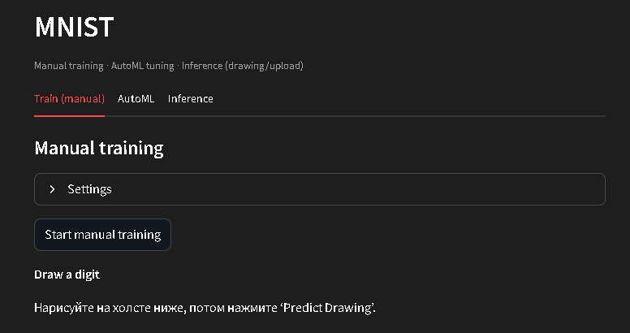
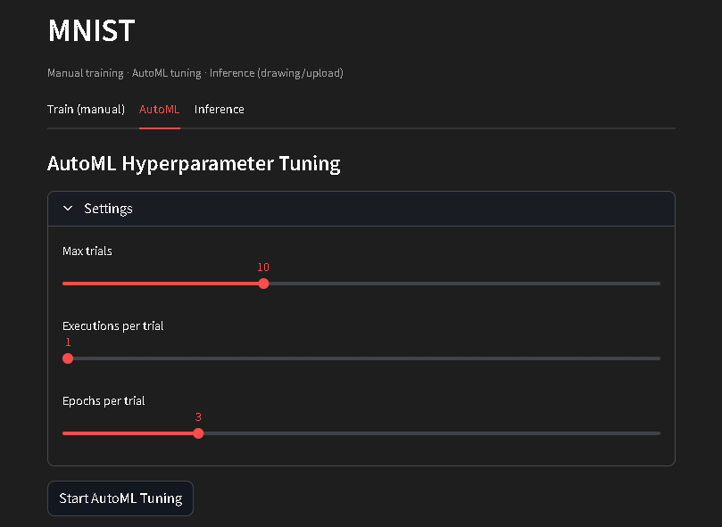
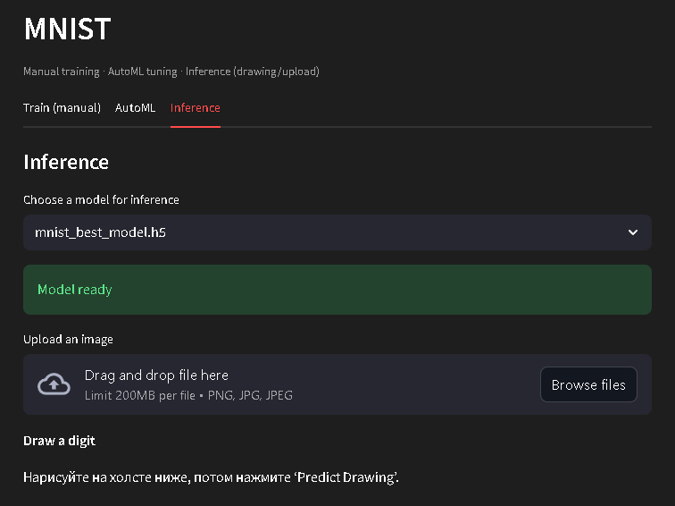

# MNIST Web-интерфейс: Обучение, AutoML и Инференс

## Обзор Проекта

Этот проект представляет собой полнофункциональное веб-приложение на Streamlit, разработанное для работы в Google Colab. Оно предоставляет интерактивный интерфейс для работы с моделью MNIST, позволяя пользователям обучать модели, проводить автоматический подбор гиперпараметров (AutoML) и выполнять инференс на новых данных, включая нарисованные от руки цифры.

## Ключевые Возможности

- **Ручное обучение модели MNIST**: Обучайте нейронную сеть для классификации рукописных цифр MNIST с возможностью настройки ключевых гиперпараметров.
- **AutoML подбор гиперпараметров (Keras Tuner)**: Используйте Keras Tuner для автоматического поиска оптимальных гиперпараметров модели, улучшая ее производительность.
- **Инференс по загруженной картинке**: Загружайте изображения цифр и получайте предсказания от обученной модели.
- **Рисование цифры в Canvas с улучшенной предобработкой**: Интерактивно рисуйте цифры прямо в браузере с помощью `streamlit-drawable-canvas`. Приложение включает улучшенную предобработку, имитирующую стиль данных MNIST, для более точных предсказаний.
- **Сохранение и загрузка обученной модели**: Сохраняйте обученные модели для дальнейшего использования и загружайте ранее сохраненные модели.
- **Автоматический запуск через ngrok**: Приложение автоматически запускается и становится доступным по публичной ссылке благодаря интеграции с ngrok.

## Установка Библиотек

Для работы приложения необходимо установить следующие Python библиотеки. Выполните следующие команды в вашей среде Colab:

```bash
!pip install streamlit tensorflow streamlit-drawable-canvas pillow pyngrok
!pip install -q keras-tuner
```

## Запуск Приложения Streamlit

Чтобы запустить веб-приложение, следуйте этим шагам:

1.  **Создайте файл `app.py`**: Приложение Streamlit содержится в файле `app.py`. Убедитесь, что этот файл создан и содержит весь необходимый код приложения.

2.  **Настройте ngrok**: Для того чтобы ваше приложение было доступно извне, вам понадобится `authtoken` от ngrok.
    *   **Шаг 1 — Получить токен ngrok**: Перейдите на сайт [ngrok](https://dashboard.ngrok.com), создайте аккаунт и скопируйте ваш `authtoken` (выглядит как `2u93hfj3k_OqIxxxxxxXSFDSFDSFDSFDSFDSFDS`).
    *   **Шаг 2 — Добавить токен в переменные Google Colab**: В Colab откройте **Меню → Tools → Variables → Add new variable**. Добавьте переменную с именем `NGROK_AUTH` и вставьте ваш токен в поле `Value`. Сохраните.

3.  **Авторизуйте ngrok**: Выполните следующую команду для авторизации ngrok с вашим токеном:

    ```python
    from pyngrok import ngrok
    from google.colab import userdata

    NGROK_TOKEN = userdata.get("NGROK_AUTH")
    ngrok.set_auth_token(NGROK_TOKEN)
    ```

4.  **Запустите Streamlit сервер и создайте туннель**: Эти команды запустят ваше приложение и сделают его доступным по публичной ссылке.

    ```python
    import subprocess
    import time

    print("Запускаем Streamlit...")
    process = subprocess.Popen(["streamlit", "run", "app.py"])
    time.sleep(5)  # ждём старт сервера
    public_url = ngrok.connect(8501)
    print("Ваш публичный URL:")
    print(public_url)
    ```

## Использование Приложения

После запуска приложения Streamlit через ngrok вы получите публичный URL, который откроет веб-интерфейс. Приложение разделено на три основные вкладки:

### 1. Train (Manual) - Ручное Обучение



На этой вкладке вы можете вручную обучить модель классификации MNIST.

-   **Настройки**: Разверните секцию `Settings`, чтобы настроить следующие гиперпараметры:
    -   `Learning rate`: Скорость обучения модели.
    -   `Epochs`: Количество эпох обучения.
    -   `Batch size`: Размер батча.
    -   `Dropout`: Процент нейронов для отбрасывания (dropout) для предотвращения переобучения.
-   **Запуск обучения**: Нажмите кнопку `Start manual training`. Во время обучения вы будете видеть графики потерь (Loss) и точности (Accuracy). После завершения обучения модель будет автоматически сохранена (`mnist_manual.h5`) и загружена для инференса.

### 2. AutoML



Эта вкладка позволяет использовать Keras Tuner для автоматического подбора гиперпараметров.

-   **Настройки**: Разверните секцию `Settings`, чтобы настроить Keras Tuner:
    -   `Max trials`: Максимальное количество различных комбинаций гиперпараметров для проверки.
    -   `Executions per trial`: Сколько раз запускать каждую комбинацию гиперпараметров (для усреднения результатов).
    -   `Epochs per trial`: Количество эпох для обучения каждой модели в рамках одного испытания.
-   **Запуск AutoML**: Нажмите кнопку `Start AutoML Tuning`. Keras Tuner начнет поиск лучших гиперпараметров. По завершении будут показаны лучшие найденные гиперпараметры, а лучшая модель будет сохранена (`mnist_best_model.h5`) и загружена.
-   **Загрузка лучшей модели**: Если AutoML был запущен ранее, вы можете нажать `Load Best AutoML Model`, чтобы загрузить сохраненную модель.

### 3. Inference - Инференс



На этой вкладке вы можете использовать обученные модели для предсказания цифр.

-   **Выбор модели**: Выберите одну из доступных обученных моделей (`mnist_manual.h5` или `mnist_best_model.h5`) из выпадающего списка.
-   **Загрузка изображения**: Используйте секцию `Upload an image`, чтобы загрузить изображение цифры с вашего компьютера. Приложение покажет загруженное изображение, предобработает его и выведет предсказанную цифру и вероятности для топ-5 классов.
-   **Рисование цифры**: Используйте интерактивный холст внизу страницы, чтобы нарисовать цифру. Нажмите `Predict Drawing`, чтобы увидеть предсказание. Для улучшения точности приложение применяет специальную предобработку, чтобы сделать нарисованную цифру похожей на данные MNIST. Вы можете обновить холст (`Refresh canvas`) или очистить рисунок (`Clear drawing`).

```